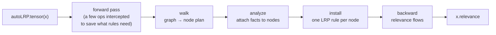

<p align="center">
  
</p>

# autoLRP

A model-agnostic PyTorch implementation of Layer-wise Relevance Propagation.
It works at the operation level, so it needs no module rewriting and no module
names: wrap your input in `autoLRP.tensor()`, run the model as it is, pick an
output scalar, and call `.lrp()`. It follows the philosophy of autograd — hence
*autoLRP*.

```python
import autoLRP
from autoLRP import LRPConfig, BASE

x = autoLRP.tensor(image)          # the input you want relevance for
out = model(x)                     # run the model unchanged
out[0, pred].lrp()                 # relevance of class `pred`
heatmap = x.relevance              # same shape as `image`
```

```bash
pip install autolrp
```

## Examples

Every figure below is produced by a notebook in [`examples/showcase`](examples/showcase);
the input is wrapped, the model runs untouched, and `.lrp()` fills `.relevance`.

**One image, two architectures.** Relevance on the pixels that drive the
*tiger shark* class — a CNN and a vision transformer, same three lines of code.

<p align="center">
  
  
</p>

**Language.** Which tokens carry the prediction — a next-token completion in
GPT-2 and a sentiment decision in BERT.

<p align="center">
  
  <br><br>
  
</p>

**BiLRP — explaining a similarity.** Beyond single predictions: decompose the
dot-product similarity of two VGG-16 embeddings into the patch *pairs* that make
the images look alike. Red pairs support the similarity, blue oppose it.

<p align="center">
  
</p>

**CP-LRP — one switch changes the attention rule.** `attn='cplrp'` treats the
attention weights as constants (Ali et al. 2022) instead of propagating through
them; the whole recipe change is one keyword.

```python
out[0, pred].lrp(config=LRPConfig(attn='cplrp'))
```

<p align="center">
  
</p>

## How it works

`.lrp()` never rewrites your model. It works on the autograd graph the forward
pass already built:



- **wrap** — `autoLRP.tensor(x)` marks the input; a handful of ops (`add`,
  `sum`, `softmax`, fused attention, …) are replaced by versions that save the
  activations the rules need. Gradients are the native ones, so the graph is
  otherwise unchanged.
- **walk** — after the forward pass, the autograd graph is traversed into an
  ordered plan of nodes.
- **analyze** — analyzers tag nodes with *facts* (for example, which operand of
  an attention product is the softmax weights).
- **install** — each node gets one hook that turns the incoming gradient into
  relevance, chosen by the config from the node's name or its facts.
- **backward** — one `backward` pass carries relevance to the wrapped input;
  whatever arrives there is `x.relevance`.

## Configuration

Every rule-bearing node is addressed by its autograd name without the version
digit, or by a fact an analyzer attached to it. `BASE` is the starting table:

```python
>>> print(BASE)
{'AddmmBackward': 'epsilon', 'MmBackward': 'epsilon', 'ConvolutionBackward': 'epsilon',
 'BmmBackward': 'epsilon', 'MulBackward': 'proportional', 'DivBackward': 'proportional',
 'AddBackward': 'proportional', 'SubBackward': 'proportional',
 'statistic_operand': ('detach', {'by': 'statistic_operand'})}
```

Override entries on it, or use a preset:

```python
LRPConfig(rule={**BASE, 'AddmmBackward': 'zplus'})
LRPConfig(rule={**BASE, 'ConvolutionBackward': ('gamma', {'gamma': 0.25})})
LRPConfig.composite()               # z+ on conv, epsilon elsewhere
LRPConfig(attn='attnlrp')           # epsilon products, Jacobian softmax
LRPConfig(attn='cplrp')             # attention weights treated as constants
LRPConfig(attn='uniform')
```

The config says exactly what runs. A key that is not a node name or a
registered fact, a rule the key's family cannot run, and a node that no entry
addresses are all errors:

```
LRPConfig(rule={**BASE, 'linear': 'zplus'})
  ValueError: unknown rule key 'linear': not a node name [...]
LRPConfig(rule={**BASE, 'MulBackward': 'zbox'})
  ValueError: rule entry 'MulBackward'='zbox': 'zbox' is not a choice here. Choices: [...]
```

Rule tables, by family:

| family   | node names                                           | rules                                                               |
| -------- | ---------------------------------------------------- | ------------------------------------------------------------------- |
| linear   | `AddmmBackward`, `MmBackward`, `ConvolutionBackward` | `epsilon`, `zplus`, `gamma`, `gamma_montavon`, `alpha_beta`, `zbox` |
| bilinear | `BmmBackward`                                        | `epsilon`, `uniform`, `detach_lhs`, `detach_rhs`                    |
| product  | `MulBackward`, `DivBackward`                         | `proportional`, `detach_lhs`, `detach_rhs`                          |
| sum      | `AddBackward`, `SubBackward`                         | `proportional`, `equal`, `fixed`, `detach_lhs`, `detach_rhs`        |

## License

MIT — see [LICENSE](LICENSE).
